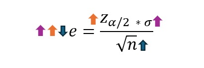

```{r setup, include=FALSE}
library(knitr)
library(readxl)
library(DT)
library(kableExtra)
library(dplyr)
library(ggplot2)
knitr::opts_chunk$set(echo = TRUE, warning = FALSE, message = FALSE)
cereal <- read_excel("C:/Users/User/Downloads/cereal.xlsx")
```
```{css,echo=FALSE}
.column {display:flex;}
h1{color:rgb(26, 72, 112)}
h2{color:rgb(26, 72, 112)}
h3{color:rgb(26, 72, 112)}
```

# Muestreo

# 6.Tamaño de la muestra si  se desea obtener un error de 25 miligramos en la estimación del sodio promedio con un 95% de confianza 

```{r}
# 1. Definición de los datos necesarios para el cálculo del tamaño de la muestra
desvest_sodiun <- sd(cereal$sodium)  # Desviación estándar de la variable Sodium (poblacional)
margen_error <- 25 # Margen de error en mg
nivel_confianza <- 0.95 # Nivel de confianza del 95%

# 2. Obtener el valor crítico Z correspondiente al nivel de confianza
z_alpha_2 <- qnorm(1 - (1 - nivel_confianza) / 2)  # Valor crítico para 95%

# 3. Aplicar la fórmula del tamaño de la muestra para estimar la media poblacional
tamaño_muestra <- ( (z_alpha_2 * desvest_sodiun) / margen_error )^2

# 4. Redondear al entero superior puesto que el tamaño de muestra debe ser entero
tamaño_muestra_entero <- ceiling(tamaño_muestra)

cat("El tamaño de la muestra es", tamaño_muestra_entero)

```

Para estimar la media del contenido de sodio en los cereales con un 95% de confianza y un margen de error de 25 mg, se determinó que se requiere una muestra de **44 observaciones**. Lo anterior indica que, bajo estas condiciones, al tomar una muestra de 44 cereales, el intervalo de confianza construido contendrá la media poblacional del sodio con una alta certeza estadística. 

# 7. Muestreo aleatorio simple para seleccionar una muestra de tamaño 44 y medidas de tendencia central y dispersión de la muestra con respecto a la variable Sodium.

```{r}
# 1.Definición de la semilla para la reproducibilidad del muestreo
set.seed(123)

# 2.Se enumeran los cereales asignándoles un ID único para mantener el orden y facilitar su identificación después del muestreo.
cereal$ID_Original <- 1:nrow(cereal) 

# 3.Definición del tamaño de la muestra (determinado previamente) 
n_1 <- tamaño_muestra_entero

# 4. Selección de la muestra aleatoria SIN reemplazo (muestreo aleatorio simple)
muestreo_aleatorio <- sample(1:nrow(cereal), size = tamaño_muestra_entero, replace = FALSE)

# 5.Creación del subconjunto de datos con los cereales seleccionados en la muestra
muestra_aleatoria <- cereal[muestreo_aleatorio, ]

# Tabla que presenta los datos de la muestra seleccionada 
datatable(muestra_aleatoria[, c("ID_Original", names(cereal)[names(cereal) != "ID_Original"])], 
          options = list(
            pageLength = 10,
            autoWidth = TRUE,
            searching = TRUE,
            scrollX = TRUE,
            lengthMenu = list(c(10, 20, 50, -1), c("10", "20", "50", "Todos"))
          ), caption = "Muestra Aleatoria de Cereales",
             rownames = FALSE
          )
```
```{r}
# 1. Extraer los valores de la variable sodium de los elementos de la muestra
valores_muestra <- muestra_aleatoria$sodium  

# 2. Definir el DataFrame con las medidas estadísticas
medidas_muestra_sodium <- data.frame(
  Medida_muestra = c("Media", "Mediana", "Moda", "Varianza", "Desviación Estándar", "Rango", "Coeficiente de Variación (%)"),
  Valor_muestra = c(
    round(mean(valores_muestra, na.rm = TRUE), 2),  
    round(median(valores_muestra, na.rm = TRUE), 2),  
    round(as.numeric(names(which.max(table(valores_muestra)))), 2),  
    round(var(valores_muestra, na.rm = TRUE), 2),  
    round(sd(valores_muestra, na.rm = TRUE), 2),  
    round(max(valores_muestra, na.rm = TRUE) - min(valores_muestra, na.rm = TRUE), 2),
    round((sd(valores_muestra, na.rm = TRUE) / mean(valores_muestra, na.rm = TRUE)) * 100, 2) # Coeficiente de variación (%)
  )
)

medidas_muestra_sodium %>%
  kable(
    caption = "Medidas de Tendencia Central y Dispersión",
    col.names = c("Estadístico", "Valor"),
    align = "c"
  ) %>%
  kable_styling(full_width = FALSE, bootstrap_options = c("striped", "hover", "condensed")) %>%
  row_spec(0, background = "#D9D9D9", bold = TRUE, extra_css = "border: 1px solid black !important;") %>%
  column_spec(1:2, border_left = TRUE, border_right = TRUE) %>%
  kable_classic(full_width = FALSE, html_font = "Cambria")

```

El contenido de sodio promedio en la muestra de cereales es 170.68 mg, lo que representa el nivel medio de sodio entre los cereales muestreados. Sin embargo, dado que la media es sensible a los valores extremos, puede no reflejar completamente la tendencia central cuando existen cereales con niveles de sodio significativamente diferentes al promedio. Por otro lado, la mediana, que es 180.00 mg, indica que el 50% de los cereales tienen un contenido de sodio inferior a este valor y el otro 50% tiene un contenido superior. El hecho de que la mediana sea mayor que la media (180 mg frente a 170.68 mg) sugiere que algunos cereales tienen un contenido de sodio considerablemente bajo, lo que arrastra la media hacia abajo, pero no afecta a la mediana, que refleja mejor el punto medio de la distribución. En cuanto la moda, se observa que esde 200.00 mg, indicando que este es el contenido de sodio más frecuente en los cereales de la muestra.

Por otro lado, el contenido de sodio en los cereales de la muestra refleja una considerable variabilidad. El rango de 320 mg refleja la diferencia entre el cereal con el contenido de sodio más bajo y el más alto, lo que sugiere que los niveles de sodio no están concentrados en un único valor. La varianza de 6949.52 mg² y la desviación estándar de 83.36 mg indican que, en promedio, los valores de sodio se desvían de la media de 170.68 mg en 83.36 mg, lo que implica que existe una dispersión significativa entre los cereales, con algunos productos con niveles mucho más altos o más bajos que el promedio. El coeficiente de variación de 48.84% muestra que esta dispersión es bastante alta en relación con la media, lo que refuerza la idea de que los niveles de sodio entre los cereales muestreados son altamente diversos. Estos valores no solo describen la muestra, sino que también sirven como estimadores de los parámetros poblacionales, sugiriendo que la variabilidad en los niveles de sodio podría ser significativa en toda la población de cereales.

# 8. Muestreo sistemático para seleccionar una muestra de 40 marcas de cereal.

```{r}
# 1. Definición de la semilla para la reproducibilidad del muestreo
set.seed(123)

# 2. Definición de datos necesarios para el muestreo sistemático 
n_2 <- 40  # Tamaño de la muestra
N <- nrow(cereal)  # Tamaño de la población

# 3. Calcular el salto entre elementos
k <- floor(N / n_2)  #Se determina cada cuántos elementos se seleccionará un dato

# 4. Cálculo de inicio del muestreo
a <- sample(1:k, 1,replace = FALSE)

# 5. Filas seleccionadas iniciando en a y saltando de k en k
filas <- seq(from = a, length.out = n_2, by = k)

# 6. Extaer de la base de datos las filas seleccionadas para la muestra
muestreo_sistematico <- cereal[filas, ]

# Visualización de resultados 
cat("Tamaño de la población (N):", N, "\n")
cat("Tamaño de la muestra (n):", n_2, "\n")
cat("Salto entre elementos (k):", k, "\n")
cat("Primer elemento seleccionado (a):", a, "\n")

# Elementos seleccionados - representación en tabla
datatable(
  muestreo_sistematico[, c("ID_Original", names(cereal)[names(cereal) != "ID_Original"])], 
  options = list(
    pageLength = 10,
    autoWidth = TRUE,
    searching = TRUE,
    scrollX = TRUE,
    lengthMenu = list(c(10, 20, 50, -1), c("10", "20", "50", "Todos"))
  ), 
  caption = " Muestra Sistemática de Cereales",
  rownames = FALSE  
)
```
Como se puede observar, el muestreo sistemático seleccionó 40 elementos de una población de 77, con un intervalo de k = 1, lo que significa que se eligió un dato tras otro sin dejar espacios entre ellos. Como el primer elemento seleccionado fue a = 1, la muestra quedó compuesta por los primeros 40 registros de la base de datos. Aunque técnicamente es un muestreo sistemático, en este caso no hay una separación real entre los elementos seleccionados, lo que podría influir en la representatividad si los datos siguen algún orden específico en la población.

# 9. Muestreo estratificado proporcional para seleccionar una muestra de 40 marcas de cereal estratificando por mfr (Manufacturer of cereal).

```{r}
# 1. Definición de la semilla para la reproducibilidad del muestreo
set.seed(123)

# 2. Definir los datos iniciales del muestreo estratificado 
N <- nrow(cereal)  #Tamaño total de la población
n_total <- 40  #Tamaño de la muestra seleccionada
r <- 7  #Número de estratos, dado que hay 7 fabricantes distintos (A, G, K, N, P, Q, R)

# 3. Crear los estratos en función del fabricante (mfr)
estrato_A <- dplyr::filter(cereal, mfr == 'A')
estrato_G <- dplyr::filter(cereal, mfr == 'G')
estrato_K <- dplyr::filter(cereal, mfr == 'K')
estrato_N <- dplyr::filter(cereal, mfr == 'N')
estrato_P <- dplyr::filter(cereal, mfr == 'P')
estrato_Q <- dplyr::filter(cereal, mfr == 'Q')
estrato_R <- dplyr::filter(cereal, mfr == 'R')

# 4. Calcular la fracción de muestreo
w <- n_total / N #Proporción de la población que será incluida en la muestra
print(paste("Fracción de muestreo (w):", round(w, 4)))

# 5. Determinar el tamaño de cada estrato en la población
N_A <- nrow(estrato_A)
N_G <- nrow(estrato_G)
N_K <- nrow(estrato_K)
N_N <- nrow(estrato_N)
N_P <- nrow(estrato_P)
N_Q <- nrow(estrato_Q)
N_R <- nrow(estrato_R)
# Mostrar la distribución inicial de los estratos en la población
print(data.frame(Estrato = c("A", "G", "K", "N", "P", "Q", "R"),
                 Población = c(N_A, N_G, N_K, N_N, N_P, N_Q, N_R)))

# 6.Calcular el tamaño de la muestra en cada estrato (muestreo proporcional)
n_A <- floor(N_A * w)
n_G <- floor(N_G * w)
n_K <- floor(N_K * w)
n_N <- floor(N_N * w)
n_P <- floor(N_P * w)
n_Q <- floor(N_Q * w)
n_R <- floor(N_R * w)
#Mostrar el tamaño de muestra proporcional calculado antes del ajuste
print(
  data.frame(
  Estrato = c("A", "G", "K", "N", "P", "Q", "R"),
  Muestra_Proporcional = c(n_A, n_G, n_K, n_N, n_P, n_Q, n_R)
))

# 7. Verificar si la suma de la muestra coincide con n_total y ajustar si es necesario
tamaño_muestra_calculado <- n_A + n_G + n_K + n_N + n_P + n_Q + n_R
print(paste("Tamaño total de la muestra calculada antes del ajuste:", tamaño_muestra_calculado))

# Ajuste de muestra si la suma no es exactamente 40
diferencia <- n_total - tamaño_muestra_calculado

if (diferencia != 0) {
  print(paste("Ajuste requerido: faltan", diferencia, "elementos."))

  # Ordenar los estratos de mayor a menor tamaño para asignar los +1
  estratos_ordenados <- data.frame(
    Estrato = c("A", "G", "K", "N", "P", "Q", "R"), 
    N = c(N_A, N_G, N_K, N_N, N_P, N_Q, N_R)
  ) %>%
    arrange(desc(N))

  # Asignar los +1 a los estratos más grandes
  for (i in 1:abs(diferencia)) {
    estrato_seleccionado <- estratos_ordenados$Estrato[i]
    
    if (estrato_seleccionado == "A") n_A <- n_A + 1
    if (estrato_seleccionado == "G") n_G <- n_G + 1
    if (estrato_seleccionado == "K") n_K <- n_K + 1
    if (estrato_seleccionado == "N") n_N <- n_N + 1
    if (estrato_seleccionado == "P") n_P <- n_P + 1
    if (estrato_seleccionado == "Q") n_Q <- n_Q + 1
    if (estrato_seleccionado == "R") n_R <- n_R + 1

    print(paste("Se añadió +1 al estrato:", estrato_seleccionado))
  }
}

# 9. Mostrar la distribución final de la muestra
print(
  data.frame(
  Estrato = c("A", "G", "K", "N", "P", "Q", "R"),
  Muestra_Final = c(n_A, n_G, n_K, n_N, n_P, n_Q, n_R)
), row.names = FALSE)

# 10. Seleccionar aleatoriamente las muestras de cada estrato
muestra_A <- dplyr::sample_n(estrato_A, n_A)
muestra_G <- dplyr::sample_n(estrato_G, n_G)
muestra_K <- dplyr::sample_n(estrato_K, n_K)
muestra_N <- dplyr::sample_n(estrato_N, n_N)
muestra_P <- dplyr::sample_n(estrato_P, n_P)
muestra_Q <- dplyr::sample_n(estrato_Q, n_Q)
muestra_R <- dplyr::sample_n(estrato_R, n_R)

# 11. Unir todas las muestras en un solo dataframe
muestra_final <- dplyr::bind_rows(muestra_A, muestra_G, muestra_K, muestra_N, muestra_P, muestra_Q, muestra_R)

datatable(
  muestra_final, 
  options = list(
    pageLength = 10,
    autoWidth = TRUE,
    searching = TRUE,
    scrollX = TRUE,
    lengthMenu = list(c(10, 20, 50, -1), c("10", "20", "50", "Todos"))
  ), 
  caption = "Muestra Estratificada de Cereales por Fabricante",
  rownames = FALSE
)

```

El muestreo estratificado nos permitió seleccionar 40 marcas de cereal, asegurando que cada fabricante estuviera representado de manera justa según su presencia en la población. La distribución final fue: G (12), K (12), N (3), P (5), Q (4), R (4) y A (0). Se ajustaron los valores para que el total sumara exactamente 40, manteniendo el equilibrio en la muestra. Un detalle interesante es que el fabricante A no quedó en la selección, lo que indica que tenía muy pocos productos en la base de datos. En general, como se puede observar, este tipo de muestreo permite que cada fabricante esté representado en la muestra según su presencia en la población total, lo que permite obtener un análisis más representativo y confiable sobre la distribución de los fabricantes de cereal.

# Intervalos de confianza

# 10. Empleando la muestra obtenida en el punto 7, obtenga un intervalo del 90%, 95%, 97.5% y 99%. Compara los errores de estimación y establece una conclusión.

Teniendo en cuenta que en el apartado 7 se realizó un muestreo aleatorio simple para seleccionar una muestra de tamaño \( n = 44 \), este valor será considerado en el cálculo de los siguientes intervalos de confianza. Asimismo, emplearemos la media muestral \( \bar{x} \), obtenida a partir de dicha muestra con respecto a la variable Sodium, para desarrollar los cálculos. Dado que se conoce la desviación estándar poblacional de esta variable (apartado de estadística descriptiva), utilizaremos la fórmula del intervalo de confianza para muestras grandes \( (n \geq 30) \), cuando la desviación estándar poblacional es conocida: 

\[
IC = \bar{x} \pm Z_{\alpha/2} \left( \frac{\sigma}{\sqrt{n}} \right)
\]

## 1. Definición de datos 
```{r}
muestra_confianza<-44 #Tamaño de muestra tomada del punto 7
media_muestral <- mean(valores_muestra, na.rm = TRUE)
desvest_poblacion <- sd(cereal$sodium)
nivel_confianza <- c(0.90,0.95,0.975,0.99) 

cat("Tamaño de la muestra (n):", muestra_confianza, "\n")
cat("Media muestral (x̄):", round(media_muestral, 4), "\n")
cat("Desviación estándar poblacional (σ):", round(desvest_poblacion, 4), "\n")
cat("Niveles de confianza:", nivel_confianza * 100, "%\n")

```
## 2. Calcular valores crítcos 

```{r}
z_valores <- qnorm(1 - (1 - nivel_confianza) / 2)

tabla_z <- data.frame(
  Nivel_Confianza = nivel_confianza * 100,
  Z_Negativo = round(-z_valores, 4),  
  Z_Positivo = round(z_valores, 4)    
)

print(tabla_z)
```

## 3. Cálcular el intervalo de confianza 

```{r}
#Calcular el margen de error 
margen_error_ic <- z_valores * (desvest_poblacion/ sqrt(muestra_confianza))

#Se suma a la estimación puntal (media muestral) el margen de error para obtener el los limites inferior y superior 

l_i<- media_muestral - margen_error_ic
l_s<- media_muestral + margen_error_ic
```

```{r,echo=FALSE}
intervalo_confianza <- as.character(paste0("[", round(l_i, 4), ", ", round(l_s, 4), "]"))

interpretacion <- paste("Con un", nivel_confianza * 100, 
                        "% de confianza, la cantidad promedio de sodio en los cereales está entre", 
                        round(l_i, 4), "y", round(l_s, 4), "miligramos.")

tabla_IC <- data.frame(
  Nivel_Confianza = paste0(nivel_confianza * 100, "%"),
  Margen_Error = round(margen_error_ic, 4),
  Intervalo = intervalo_confianza,
  Interpretación = interpretacion
)

kable(tabla_IC, caption = "Intervalos de Confianza y su Interpretación", align = "c") %>%
    kable_styling(full_width = FALSE, bootstrap_options = c("striped", "hover", "condensed"), 
                  latex_options = c("hold_position", "scale_down")) %>%
    column_spec(1, bold = TRUE, border_right = TRUE) %>%
    column_spec(2, border_left = TRUE, border_right = TRUE) %>%  
    column_spec(3, border_left = TRUE, border_right = TRUE) %>%
    column_spec(4, border_left = TRUE, border_right = TRUE) %>%
    row_spec(0, background = "#D9D9D9", bold = TRUE, extra_css = "border: 1px solid black !important;") %>%  
    row_spec(1:nrow(tabla_IC), extra_css = "border: 1px solid black !important;")
```

La próxima gráfica muestra mejor la comparativa de los niveles de confianza y su margen de error: 

```{r,echo=FALSE}
df_plot <- data.frame(
  Nivel_Confianza = factor(paste0(nivel_confianza * 100, "%"), levels = paste0(nivel_confianza * 100, "%")),
  Media = media_muestral,
  Límite_Inferior = l_i,
  Límite_Superior = l_s
)

ggplot(df_plot, aes(x = Media, y = Nivel_Confianza)) +
  geom_point(size = 4, color = "blue") + 
  geom_errorbarh(aes(xmin = Límite_Inferior, xmax = Límite_Superior), height = 0.2, color = "red") +  
  geom_vline(xintercept = media_muestral, linetype = "dashed", color = "black") +  
  labs(
    title = "Intervalos de Confianza para la Media de Sodio",
    x = "Miligramos de Sodio",
    y = "Nivel de Confianza",
    caption = "Los puntos representan la media muestral y las líneas rojas los intervalos de confianza."
  ) +
  theme_minimal() +
  theme(
    plot.title = element_text(hjust = 0.5, face = "bold", size = 14), 
    plot.caption = element_text(hjust = 0.5, size = 10), 
    axis.title.x = element_text(face = "bold"),  
    axis.title.y = element_text(face = "bold")
  )

```


Como se puede evidenciar, a medida que el nivel de confianza aumenta, el margen de error también se incrementa, ampliando los rangos de estimación. Por ejemplo, con un 90% de confianza, la cantidad promedio de sodio está entre 149.89 y 191.47 mg, mientras que con un 99%, el intervalo se extiende de 138.13 a 203.24 mg. Por tanto, se podría decir queun mayor nivel de confianza ofrece más certeza de que la media real se encuentre dentro del intervalo, pero a costa de perder precisión en la estimación. Por el contrario, un margen de error más pequeño mejora la exactitud, pero con menor certeza.

En este contexto, es evidente que si queremos un mayor nivel de confianza esto implica abarcar un rango más extenso de valores para asegurarnos de que la media poblacional real se encuentre dentro del intervalo, y teniendo en cuenta que el margen de error es lo que se le suma o resta a la estimación puntual, una mayor amplitud del intervalo refleja un margen de error más grande, lo que significa que el valor real tiene más espacio para variar en ambas direcciones.[^7]

Asimismo, esta relación directa entre el margen de error y el intervalo de confianza se puede verificar con la fórmula para el cálculo del margen de error. Como se muestra a continuación, el incremento del nivel de confianza implica aumentar el valor crítico \(Z_{\alpha/2}\), lo que a su vez incrementa el margen de error, ampliando el intervalo. De la misma manera, podemos inferir que, si disminuimos el tamaño de la muestra o aumentamos la variabilidad de los datos poblacionales, el margen de error también aumentaría. Esto se traduce en una mayor incertidumbre en la estimación y una menor precisión.[^6]

<center>
{width=500}
</center>

[^6]: **Guía de muestreo en R**:Felipe1986. Muestreo en R. RPubs. Recuperado de https://rpubs.com/Felipe1986/MuestreoTutorialR.

[^7]:**Intervalos de confianza:** Humberto_Mtz_Bta. Intervalos de confianza en R. RPubs. Recuperado de https://rpubs.com/Humberto_Mtz_Bta/903713.


